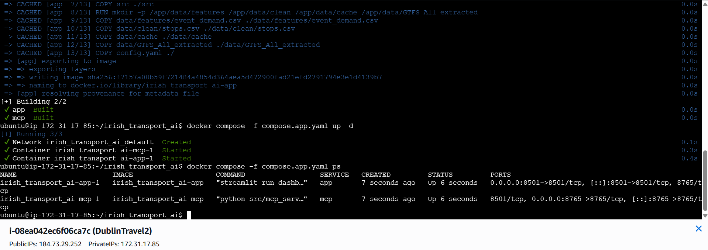
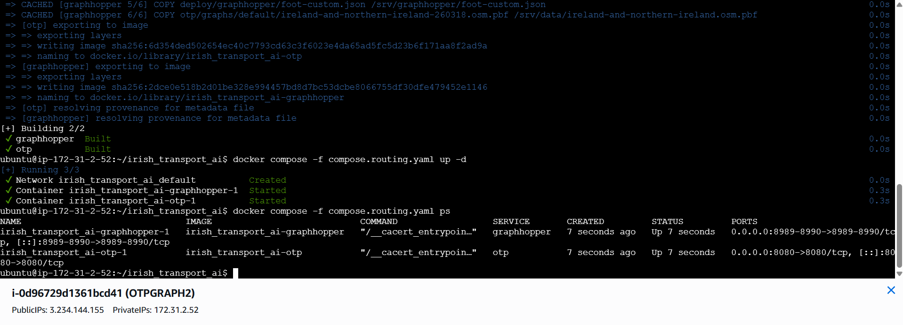
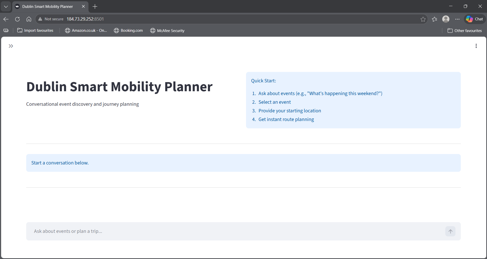
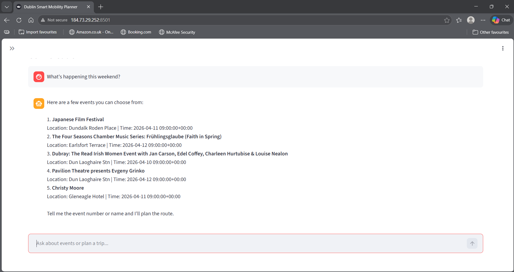
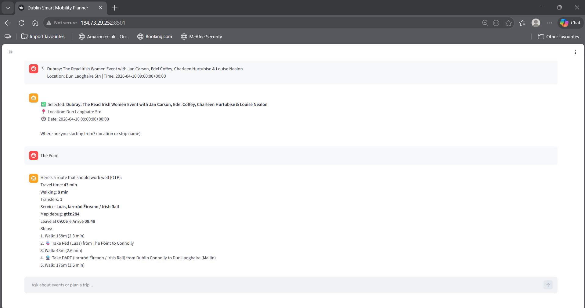

# Dublin Smart Mobility Planner

An AI-powered multimodal journey planner for Dublin and Ireland that combines event discovery, conversational trip planning, public transport routing, and pedestrian routing in one system.

This project combines an LLM-driven interface with real transport and tourism infrastructure:

- `Streamlit` for the user-facing chat experience
- `LangGraph` for multi-step conversational orchestration
- `MCP` for tool execution and service access
- `OpenTripPlanner (OTP)` for transit routing
- `GraphHopper` for walking routes
- `GTFS`, `OSM`, and tourism/event datasets for transport and destination context

## AWS Deployment Highlight

This project is designed to run as a cloud-hosted demo on AWS EC2.

The recommended deployment model is:

- an AWS EC2 app instance for `Streamlit` and `MCP`
- an AWS EC2 routing instance for `OTP` and `GraphHopper`
- AWS-managed LLM access through `Bedrock`
- manually provisioned runtime assets for the routing layer

This keeps the public demo lightweight while still using real transit and routing services in the cloud.

## What It Does

The planner supports flows like:

- finding events happening this weekend
- selecting an event and planning a route to it
- routing from a stop name, district, or address
- showing nearby accommodations and attractions
- replanning to a selected accommodation or attraction
- rendering route maps with transit styling and street-based walking paths

## Project Focus

The system focuses on:

- full-stack AI product thinking
- LLM orchestration beyond simple prompting
- geospatial and transport data integration
- service orchestration across multiple runtime components
- deployment thinking for local Docker and AWS EC2
- practical debugging of real-world routing issues

## Supported Runtime

The supported app path is:

- UI: `dashboard/chat.py`
- agent logic: `src/llm/`
- MCP server: `src/mcp_server.py`
- OTP runtime: `otp/`
- GraphHopper runtime: `deploy/graphhopper/`

The repo also contains archived material from earlier experiments and diagnostics, but the Docker/AWS path above is the supported runtime.

## Architecture

```text
Streamlit UI (dashboard/chat.py)
        |
        v
LangGraph agent (src/llm/graph.py)
        |
        v
MCP tool gateway (src/mcp_server.py / src/llm/tool_gateway.py)
        |
        +--> OTP for transit itineraries
        +--> GraphHopper for walking routes
        +--> geocoding and GTFS helpers
        +--> events / attractions / accommodations datasets
```

More detail:

- [Architecture Guide](docs/ARCHITECTURE.md)
- [Demo Checklist](docs/DEMO_CHECKLIST.md)
- [Deployment Guide](DEPLOYMENT.md)

## Demo Video

[](https://www.youtube.com/watch?v=9Up1x95cqJo)

Direct link:

`https://www.youtube.com/watch?v=9Up1x95cqJo`

## Screenshots

Store screenshots in `docs/images/`.

Suggested images for the final README:

- `docs/images/aws-app-instance.png`
- `docs/images/aws-routing-instance.png`
- `docs/images/app-home.png`
- `docs/images/app-events.png`
- `docs/images/app-route.png`

Recommended order:

### AWS App Instance

Use a screenshot that shows:

- EC2 instance name
- instance state
- public IPv4 address
- security group or running status if visible



### AWS Routing Instance

Use a screenshot that shows:

- OTP/GraphHopper EC2 instance
- instance state
- public IPv4 address
- routing role in the architecture



### App Home



### Event Discovery



### Route Planning Map



## Repository Layout

Core areas:

- `dashboard/` Streamlit UI
- `src/` agent logic, tools, graph orchestration, and MCP server
- `deploy/aws/` AWS deployment notes
- `deploy/graphhopper/` GraphHopper config files for deployment
- `otp/` OTP runtime files and graph assets
- `data/` cached tourism, GTFS, and supporting datasets
- `archive/` legacy notes and earlier artifacts not part of the main runtime path

## Local Docker Run

1. Copy the environment template:

```bash
cp .env.example .env
```

2. Configure either:

- `LLM_PROVIDER=ollama`
- or `LLM_PROVIDER=openai` with an `OPENAI_API_KEY`

3. Make sure the required runtime assets exist locally:

- `otp/otp-shaded-2.8.1.jar`
- `otp/graphs/default/graph.obj`
- `otp/graphs/default/ireland-and-northern-ireland-260318.osm.pbf`
- `deploy/graphhopper/graphhopper-web-10.2.jar`
- `deploy/graphhopper/config-example.yml`
- `deploy/graphhopper/foot-custom.json`

4. Start the stack:

```bash
docker compose up --build -d
```

5. Open:

```text
http://localhost:8501
```

## AWS Deployment Model

For interview and portfolio demos, the recommended deployment is:

- one AWS EC2 instance
- Docker Engine + Docker Compose
- the app, MCP, OTP, GraphHopper, and optionally Ollama running as containers

Recommended docs:

- [Deployment Guide](DEPLOYMENT.md)
- [AWS Notes](deploy/aws/README.md)

## GitHub vs Runtime Assets

This repository uses a hybrid deployment model:

- GitHub holds the code, Dockerfiles, configs, and docs
- EC2 receives the large runtime assets separately before `docker compose build`

That keeps the repository lightweight while still supporting the full Docker runtime on EC2.

Runtime assets that are typically copied manually to EC2:

- OTP jar
- OTP graph files
- Ireland OSM extract
- GraphHopper jar

## Additional Docs

- [Architecture Guide](docs/ARCHITECTURE.md)
- [Demo Checklist](docs/DEMO_CHECKLIST.md)
- [Deployment Guide](DEPLOYMENT.md)
